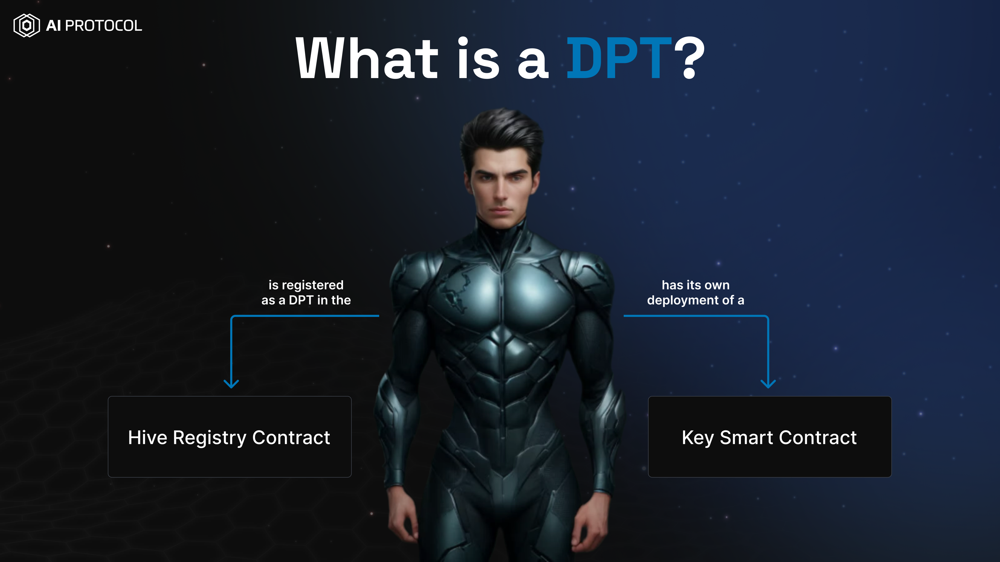

## Decentralized Pre-Trained Transformers (DPT)
A Decentralized Pre-Trained Transformer (DPT) is a tokenized AI system with specialized functionality and embedded
liquidity, offering a range of services. It can issue unique digital assets, termed "Keys", addressing the issue of low
liquidity in blockchain-based assets.

Any ERC721 Token (NFT) can be converted into a DPT using AI protocol smart contracts. To convert an ERC721 Token (NFT)
into a DPT you must own that NFT.

**I own an NFT how can I convert it into a DPT?**

Check out our guides to perform various operations with DPTs.

## How to
 
* [Convert an NFT into a DPT?](./guides/convert-nft-to-dpt/README.md)
* [Convert an iNFT into a DPT?](./guides/convert-inft-to-dpt/README.md)
* [Buy/Sell Keys of DPT](./guides/buy-sell-keys-of-dpt/buy-sell-keys-of-dpt.md)
* [Fuse a Level 5 Pod with a DPT?](./guides/fuse-pod-with-dpt/fuse-pod-with-dpt.md)
* [Launch a Utility Token for your DPT?](./guides/how-to-launch-utility-token/how-to-launch-utility-token-dpt.md)
* [Create a Liquidity Pool on Uniswap for the Utility Token of your DPT?](./guides/how-to-create-liquidity-pool-dpt.md)